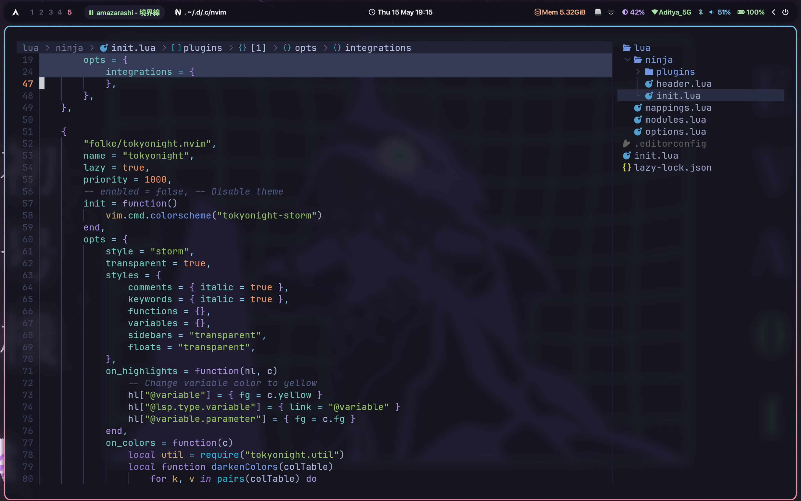
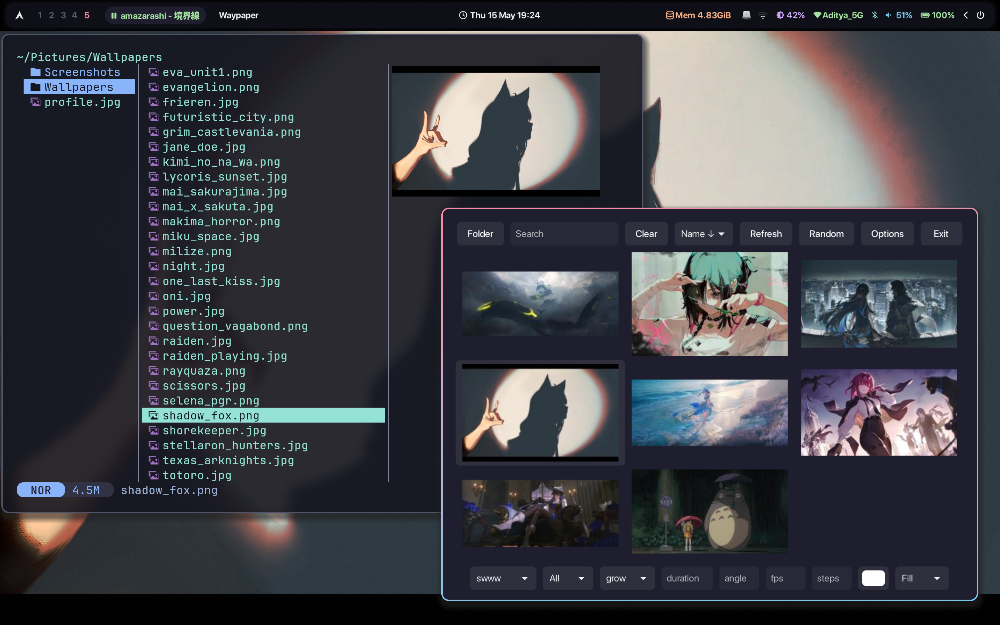
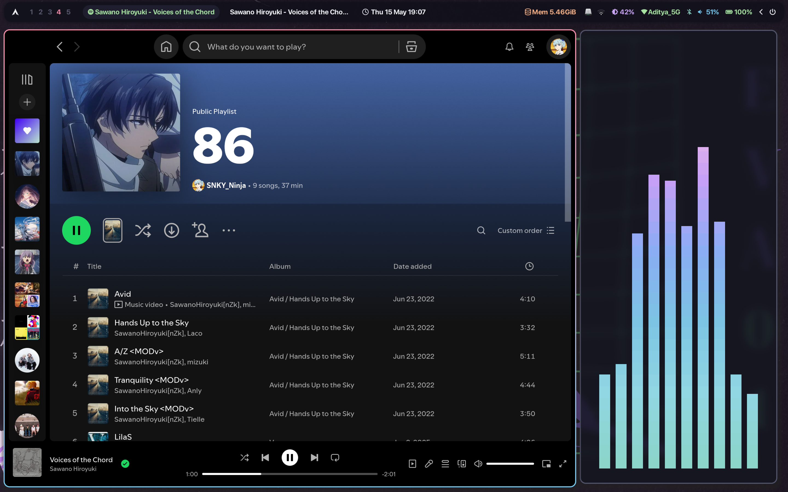

<p align="center" style="color:grey">
<div align="center">
<table>
<tbody>
<td align="center">
<br>

These dotfiles are for **[Arch Linux](https://archlinux.org)** based systems and **[Hyprland](https://hyprland.org)** as window manager<br>
If you liked the repo, give a star ⭐ — found a bug? Open an [issue](https://github.com/SNKYNinja/.dotfiles/issues/new)!


</td>
</tbody>
</table>
</div>
</p>

### Prerequisites

> [!Note]
> Tools that are required to get the config working.<br>
> You can prefer `-git` version of the packages if something is not working.

##### Required:

```bash
yay -S \
  # Hyprland Packages
  hyprland hyprlock hypridle hyprpicker-git hyprshade xdg-desktop-portal-hyprland \
  # Terminal & Shell Related
  kitty fish starship aurutils eza \
  # Utility Packages
  pipewire dart-sass cliphist grimblast-git jq brightnessctl fastfetch fcitx5 \
  # DE Widgets / UI Tools
  waybar rofi-lbonn-wayland-git mako btop cava pavucontrol swww waypaper wlogout \
  # Theming / Appearance
  catppuccin-gtk-theme-mocha kvantum qt5ct qt6ct nwg-look ttf-jetbrains-mono \
  # File Managers
  yazi nautilus
```

> [!Note]
> Config uses **[SF Pro Font](https://developer.apple.com/fonts/)** mostly so its recommended to install it<br> 
> Put the font in `/usr/share/fonts`

##### Optional

```bash 
yay -S batsignal dua-cli gnome-calendar rofimoji udiskie vimiv zathura
```

### Setup

```bash
git clone https://github.com/SNKYNinja/.dotfiles.git ~/.dotfiles
cd ~/.dotfiles
chmod +x ./install.sh && ./install.sh
```

### Previews



|  |  |
| --------------------------------------------------------------------------------------------------- | --------------------------------------------------------------------------------------------------- |



<p align="center"></p>

